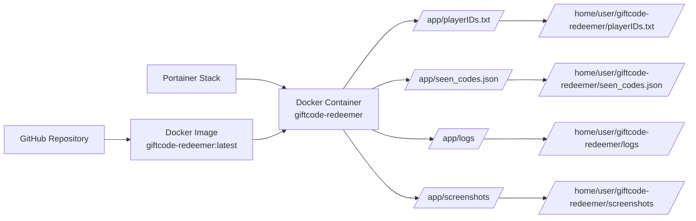

# Docker Setup Instructions (Portainer)

These instructions explain how to run **GiftCode Redeem Automation** in Docker while managing it with **Portainer**.

---

# Tested Environment

These instructions were tested with:

- Ubuntu Server
- Docker Engine
- Portainer CE (Standalone)

---

# Table of Contents

- [Architecture Overview](#architecture-overview)
- [1. Prepare the Environment](#1-prepare-the-environment)
- [2. Create the Player ID File](#2-create-the-player-id-file)
- [3. Create the seen_codes.json File](#3-create-the-seen_codesjson-file)
- [4. Create the Docker Build Folder](#4-create-the-docker-build-folder)
- [5. Create the Dockerfile](#5-create-the-dockerfile)
- [6. Build the Docker Image](#6-build-the-docker-image)
- [7. Create the Stack in Portainer](#7-create-the-stack-in-portainer)
- [8. Verify the Container](#8-verify-the-container)
- [Updating the Container Later](#updating-the-container-later)

---

# Architecture Overview



⚠️ Only the following files persist outside the container:

- `playerIDs.txt`
- `seen_codes.json`
- `logs/`
- `screenshots/`

Rebuilding the Docker image **will NOT affect these files**.

---

# 1. Prepare the Environment

Create the required folders:

```bash
mkdir -p $HOME/giftcode-redeemer
mkdir -p $HOME/giftcode-redeemer/logs
mkdir -p $HOME/giftcode-redeemer/screenshots
```

---

# 2. Create the Player ID File

Create the file:

```bash
vi $HOME/giftcode-redeemer/playerIDs.txt
```

Add your player IDs **one per line**.

Example:

```
123456789
987654321
112233445
```

Save the file.

---

# 3. Create the seen_codes.json File

Create the file:

```bash
vi $HOME/giftcode-redeemer/seen_codes.json
```

Add the following content:

```json
{"redeemed":[]}
```

Save the file.

This file stores codes that have already been redeemed so the script does not attempt to redeem them again.

---

# 4. Create the Docker Build Folder

Create a folder used to build the Docker image.

```bash
mkdir $HOME/giftcode-docker
cd $HOME/giftcode-docker
```

---

# 5. Create the Dockerfile

Create the Dockerfile:

```bash
vi Dockerfile
```

Paste the following content:

```dockerfile
FROM python:3.11-slim-bookworm

WORKDIR /app

RUN apt-get update && apt-get install -y \
    wget curl gnupg unzip git \
    libnss3 libxi6 libxcursor1 \
    libxcomposite1 libxdamage1 libxrandr2 \
    libxss1 libxtst6 libatk-bridge2.0-0 \
    libgtk-3-0 libgbm1 fonts-liberation \
    && rm -rf /var/lib/apt/lists/*

RUN wget -q -O /tmp/chrome.deb https://dl.google.com/linux/direct/google-chrome-stable_current_amd64.deb \
 && apt-get update \
 && apt-get install -y /tmp/chrome.deb \
 && rm /tmp/chrome.deb \
 && rm -rf /var/lib/apt/lists/*

RUN git clone https://github.com/Gopi360/GiftCode-Redeem-Automation.git /app

RUN pip install --no-cache-dir -r requirements.txt

CMD ["python", "main.py"]
```

Save the file.

---

# 6. Build the Docker Image

Run the following commands:

```bash
cd $HOME/giftcode-docker
docker build -t giftcode-redeemer:latest .
```

Verify the image was created:

```bash
docker images | grep giftcode-redeemer
```

---

# 7. Create the Stack in Portainer

Open **Portainer** and go to:

```
Stacks → Add stack
```

Name the stack:

```
giftcode-redeemer
```

Paste the following stack configuration.

⚠️ Replace `/home/youruser/` with your actual home directory if necessary.

```yaml
version: "3.5"

services:
  giftcode-redeemer:
    image: giftcode-redeemer:latest
    container_name: giftcode-redeemer
    restart: unless-stopped

    volumes:
      - "/home/youruser/giftcode-redeemer/playerIDs.txt:/app/playerIDs.txt"
      - "/home/youruser/giftcode-redeemer/logs:/app/logs"
      - "/home/youruser/giftcode-redeemer/screenshots:/app/screenshots"
      - "/home/youruser/giftcode-redeemer/seen_codes.json:/app/seen_codes.json"
      - "/etc/localtime:/etc/localtime:ro"

    environment:
      - "TZ=Europe/London"
```

Click **Deploy the stack**.

---

# 8. Verify the Container

In Portainer:

```
Containers → giftcode-redeemer → Logs
```

You should see messages similar to:

```
Checking for new gift codes...
```

The script polls for new codes **every 15 minutes**.

---

# Updating the Container Later

If the GitHub repository is updated, rebuild the image:

```bash
cd $HOME/giftcode-docker
docker build --no-cache -t giftcode-redeemer:latest .
```

Then in Portainer:

```
Stacks → giftcode-redeemer → Update the stack
```

Your player IDs, redeemed codes, logs, and screenshots will remain intact because they are stored outside the container.
